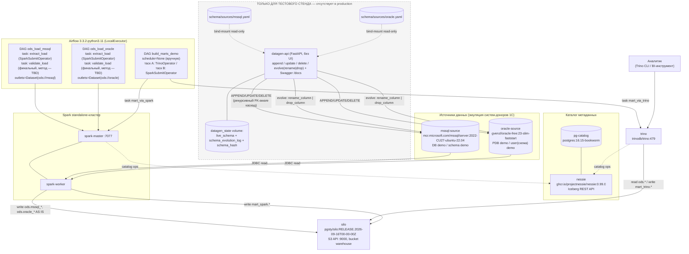

# datalake_stand — PoC стенда КХД → DLH

Локальный docker-compose стенд: загрузка данных из реальных реляционных
источников (MSSQL, Oracle) в ODS-слой Iceberg **AS IS**, и демонстрация
двух способов трансформации данных внутри DataLake (Trino SQL и Spark).

## Архитектура



## Состав стенда

**Контур A (релевантно production DLH-архитектуре):**

| Компонент           | Образ/версия                                                                                     |
| ------------------- | ------------------------------------------------------------------------------------------------ |
| mssql-source        | `mcr.microsoft.com/mssql/server:2022-CU27-ubuntu-22.04`¹                                         |
| oracle-source       | `gvenzl/oracle-free:23-slim-faststart`                                                           |
| pg-catalog          | `postgres:16.15-bookworm`                                                                        |
| nessie              | `ghcr.io/projectnessie/nessie:0.99.0`                                                           |
| silo                | `pgsty/silo:RELEASE.2026-09-16T00-00-00Z`                                                        |
| spark-master/worker | база `tabulario/spark-iceberg:3.5.5_1.8.1` + `mssql-jdbc:12.10.0.jre11` + `ojdbc11:23.8.0.25.04` |
| trino               | `trinodb/trino:479`                                                                              |
| airflow             | `apache/airflow:3.3.2-python3.11`, LocalExecutor                                                 |

¹ Закреплено на конкретном CU: `2022-CU27-ubuntu-22.04` — этот тег совпадает с `2022-latest` на 2026-10-09 (для воспроизводимости). Для обновления взять следующий `2022-CUxx-ubuntu-22.04` из каталога MCR.

**Контур B (только тестовый стенд, нет в production):** `datagen-api` —
REST API для наполнения источников синтетическими данными и ограниченной
эволюции их схемы (`rename_column`/`drop_column`). Схема источников
зафиксирована в `schema/sources/mssql.yaml` / `schema/sources/oracle.yaml`.

## Быстрый старт

```bash
docker compose up -d --build
```

Порты:

| Сервис                       | Порт на хосте |
| ---------------------------- | ------------- |
| mssql-source                 | 1433          |
| oracle-source                | 1521          |
| datagen-api                  | 8090          |
| nessie                       | 19120         |
| silo (S3 API / консоль)      | 9000 / 9001   |
| spark-master UI              | 8080          |
| spark-worker UI              | 8081          |
| trino (HTTPS)                | 8443          |
| airflow webserver/api-server | 8089          |

## Доступ к сервисам

### Web-интерфейсы

| Сервис | URL | Логин/пароль |
|---|---|---|
| Spark Master UI | http://localhost:8080 | без авторизации |
| Spark Worker UI | http://localhost:8081 | без авторизации |
| SILO (консоль, MinIO-совместимая) | http://localhost:9001 | `admin` / `admin123` (`SILO_ROOT_USER`/`SILO_ROOT_PASSWORD`) |
| datagen-api (Swagger UI) | http://localhost:8090/docs | без авторизации (см. `## Учётные данные` про сам инструмент) |
| Airflow | http://localhost:8089 | `admin` / `admin` (`AIRFLOW_UI_USER`/`AIRFLOW_UI_PASSWORD`) |

### Подключение из DBeaver (на машине, где запущен docker)

DBeaver подключается к `localhost` — порты опубликованы в `docker-compose.yaml`
(см. таблицу портов выше).

**Trino** — драйвер «Trino» (встроен в DBeaver):
- Host: `localhost`, Port: `8443`
- Use SSL: да (Trino работает по HTTPS с самоподписанным сертификатом)
- Catalog/Database: `iceberg`
- Username: `admin`, Password: `admin`
  (включена авторизация файловым password-authenticator'ом — см. `trino/etc/`)
- На вкладке Driver properties отключить проверку сертификата:
  `SSL=true;SSLVerification=NONE` (самоподписанный сертификат контейнера)
- JDBC URL целиком: `jdbc:trino://localhost:8443/iceberg?SSL=true&SSLVerification=NONE`

**mssql-source** — драйвер «SQL Server» (Microsoft):
- Host: `localhost`, Port: `1433`
- Database: `demo`
- Authentication: SQL Server Authentication
- Username: `admin`, Password: `admin`
  (прикладной логин `admin`/`admin` с правами sysadmin создаёт `datagen-api`
  при старте; системный bootstrap-логин `sa` использует сильный пароль
  `MSSQL_SA_PASSWORD` из `.env`)
- На вкладке Driver properties (или прямо в URL) нужно отключить шифрование/проверку
  сертификата, иначе DBeaver откажется подключаться к самоподписанному сертификату
  контейнера: `encrypt=false;trustServerCertificate=true`.

**oracle-source** — драйвер «Oracle»:
- Host: `localhost`, Port: `1521`
- Connection type: Service Name, значение `demo`
  (это pluggable database `demo`, созданная переменной `ORACLE_DATABASE=demo`,
  а не стандартный `FREEPDB1`)
- Username: `demo`, Password: значение `ORACLE_APP_PASSWORD` из `.env`
  (по умолчанию `admin`)
- Дополнительных настроек/Oracle Instant Client не требуется (используется
  тонкий JDBC-драйвер).

## Учётные данные

Тестовый стенд — везде, где логин/пароль настраиваемы, используется
`admin` / `admin` (см. `.env`). Исключение по имени — системный
bootstrap-логин MSSQL `sa`: имя фиксировано образом, а пароль не может быть
буквально `admin` (MSSQL требует длину ≥8 и минимум 3 из 4 категорий символов),
поэтому у `sa` остаётся сильный пароль `AdminPassword1!`, а для доступа извне
`datagen-api` автоматически создаёт логин `admin`/`admin` с ролью sysadmin.
SILO (консоль `:9001`) — `admin`/`admin123` (MinIO требует пароль ≥8 символов,
поэтому буквально `admin` невозможен), pg-catalog, airflow-postgres,
Airflow UI (`:8089`), Trino (`:8443`) — везде `admin`/`admin`. У Oracle системные SYS/SYSTEM и
прикладной пользователь-схема `demo` (бизнес-схема данных, имя сознательно
оставлено `demo`) — пароль `admin`.

## ⚠️ Важно: потеря данных при изменении схемы

Если изменить `schema/sources/mssql.yaml` или `schema/sources/oracle.yaml`
и перезапустить контейнер `datagen-api` — **все данные этого источника
будут удалены**, а таблицы пересозданы пустыми по новой схеме. Это
осознанное упрощение для тестового стенда: предыдущее состояние не
архивируется. Пока контейнер работает без перезапуска, изменения файла
на хосте не подхватываются — реакция происходит только при следующем
(пере)старте контейнера `datagen-api`.
