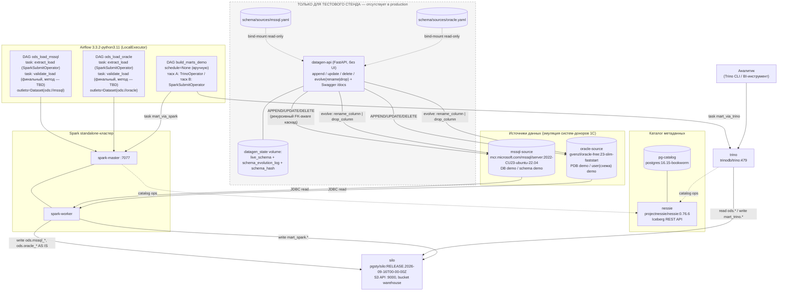

# datalake_stand — PoC стенда КХД → DLH

Локальный docker-compose стенд: загрузка данных из реальных реляционных
источников (MSSQL, Oracle) в ODS-слой Iceberg **AS IS**, и демонстрация
двух способов трансформации данных внутри DataLake (Trino SQL и Spark).

## Архитектура



## Состав стенда

**Контур A (релевантно production DLH-архитектуре):**

| Компонент | Образ/версия | Роль |
|---|---|---|
| mssql-source | `mcr.microsoft.com/mssql/server:2022-CU23-ubuntu-22.04`¹ | источник (DB `demo`, схема `demo`) |
| oracle-source | `gvenzl/oracle-free:23-slim-faststart` | источник (PDB `demo`, пользователь/схема `demo`) |
| pg-catalog | `postgres:16.15-bookworm` | metastore для Nessie |
| nessie | `projectnessie/nessie:0.76.6` | Iceberg REST каталог, JDBC version-store |
| silo | `pgsty/silo:RELEASE.2026-09-16T00-00-00Z` | S3-совместимое хранилище (форк MinIO), бакет `warehouse` |
| spark-master/worker | база `tabulario/spark-iceberg:3.5.5_1.8.1` + `mssql-jdbc:12.10.0.jre11` + `ojdbc11:23.8.0.25.04` | AS IS загрузка источников → ODS |
| trino | `trinodb/trino:479` | трансформации внутри лейка + ad-hoc доступ аналитиков |
| airflow | `apache/airflow:3.3.2-python3.11`, LocalExecutor | оркестрация |

¹ тег не подтверждён независимо (сетевые тайм-ауты при подборе) — перепроверить по каталогу MCR перед сборкой.

**Контур B (только тестовый стенд, нет в production):** `datagen-api` —
REST API для наполнения источников синтетическими данными и ограниченной
эволюции их схемы (`rename_column`/`drop_column`). Схема источников
зафиксирована в `schema/sources/mssql.yaml` / `schema/sources/oracle.yaml`.

## Быстрый старт

`.env` уже в репозитории с рабочими значениями (`admin`/`password`) — ничего
копировать/заполнять перед запуском не нужно:

```bash
docker compose up -d --build
```

Порты:

| Сервис | Порт на хосте | Назначение |
|---|---|---|
| mssql-source | 1433 | T-SQL |
| oracle-source | 1521 | SQL*Net |
| datagen-api | 8090 | Swagger UI на `http://localhost:8090/docs` |
| nessie | 19120 | Iceberg REST catalog |
| silo (S3 API / консоль) | 9000 / 9001 | S3-совместимое хранилище |
| spark-master UI | 8080 | |
| spark-worker UI | 8081 | |
| trino | 8082 | `http://localhost:8082` |
| airflow webserver/api-server | 8089 | admin/password (см. `airflow-init`) |

## Доступ к сервисам

### Web-интерфейсы

| Сервис | URL | Логин/пароль |
|---|---|---|
| Spark Master UI | http://localhost:8080 | без авторизации |
| Spark Worker UI | http://localhost:8081 | без авторизации |
| SILO (консоль, MinIO-совместимая) | http://localhost:9001 | `admin` / `password` (`SILO_ROOT_USER`/`SILO_ROOT_PASSWORD`) |
| datagen-api (Swagger UI) | http://localhost:8090/docs | без авторизации (см. `## Учётные данные` про сам инструмент) |
| Airflow | http://localhost:8089 | `admin` / `password` (`AIRFLOW_UI_USER`/`AIRFLOW_UI_PASSWORD`) |

### Подключение из DBeaver (на машине, где запущен docker)

DBeaver подключается к `localhost` — порты опубликованы в `docker-compose.yaml`
(см. таблицу портов выше).

**Trino** — драйвер «Trino» (встроен в DBeaver):
- Host: `localhost`, Port: `8082`
- Catalog/Database: `iceberg`
- Авторизация в Trino не настроена — в DBeaver можно указать любой
  Username (например `admin`), поле Password оставить пустым.
- JDBC URL целиком: `jdbc:trino://localhost:8082/iceberg`

**mssql-source** — драйвер «SQL Server» (Microsoft):
- Host: `localhost`, Port: `1433`
- Database: `demo`
- Authentication: SQL Server Authentication
- Username: `sa`, Password: значение `MSSQL_SA_PASSWORD` из `.env` (по умолчанию `AdminPassword1!`)
- На вкладке Driver properties (или прямо в URL) нужно отключить шифрование/проверку
  сертификата, иначе DBeaver откажется подключаться к самоподписанному сертификату
  контейнера: `encrypt=false;trustServerCertificate=true`.

**oracle-source** — драйвер «Oracle»:
- Host: `localhost`, Port: `1521`
- Connection type: Service Name, значение `demo`
  (это pluggable database `demo`, созданная переменной `ORACLE_DATABASE=demo`,
  а не стандартный `FREEPDB1`)
- Username: `demo`, Password: значение `ORACLE_APP_PASSWORD` из `.env`
  (по умолчанию `password`)
- Дополнительных настроек/Oracle Instant Client не требуется (используется
  тонкий JDBC-драйвер).

## Учётные данные

Тестовый стенд — везде, где логин/пароль настраиваемы, используется
`admin` / `password` (см. `.env`). Исключение: MSSQL `sa` —
имя пользователя фиксировано образом, а пароль не может быть буквально
`password` (MSSQL требует длину ≥8 и минимум 3 из 4 категорий символов) —
используется `AdminPassword1!`. SILO (консоль `:9001`), pg-catalog,
airflow-postgres, Airflow UI (`:8089`), Oracle (`ORACLE_PASSWORD`) — везде
`admin`/`password`. Исключение по имени (не по паролю): у Oracle отдельно есть
прикладной пользователь-схема `demo` (бизнес-схема данных, а не админский
аккаунт) — его пароль тоже `password`, но имя сознательно осталось `demo`.

## ⚠️ Важно: потеря данных при изменении схемы

Если изменить `schema/sources/mssql.yaml` или `schema/sources/oracle.yaml`
и перезапустить контейнер `datagen-api` — **все данные этого источника
будут удалены**, а таблицы пересозданы пустыми по новой схеме. Это
осознанное упрощение для тестового стенда: предыдущее состояние не
архивируется. Пока контейнер работает без перезапуска, изменения файла
на хосте не подхватываются — реакция происходит только при следующем
(пере)старте контейнера `datagen-api`.

## Backlog (вне объёма текущего этапа)

- Перенос хранимых процедур КХД и сверка результата с их эталоном.
- Конкретное бизнес-содержание будущих detail/mart-слоёв
  (`build_mart_trino_demo.sql` / `build_mart_spark_demo.py` — заглушки).
- dbt-trino как альтернатива прямым SQL/PySpark-скриптам.
- `add_column` / `alter_column_type` в `datagen-api` (`evolve` поддерживает
  только `rename_column` и `drop_column`).
- Метод `validate_load` в DAG-ах `ods_load_*` — открытый вопрос: простой
  `COUNT(*)` может быть неверен, если в источнике были `DELETE` между
  загрузками, а Iceberg хранит накопленную историю. Нужно сначала выбрать
  стратегию загрузки ODS (`APPEND` vs `MERGE`/overwrite), а потом метод сверки.

## Известные риски

- Тег `mcr.microsoft.com/mssql/server:2022-CU23-ubuntu-22.04` не подтверждён
  независимо (сетевые тайм-ауты при подборе) — перепроверить по каталогу MCR.
- `apache-airflow-providers-apache-spark==6.3.2` требует `pyspark-client>=4.0.0`
  (пакет Spark Connect) — нужно подтвердить, что `SparkSubmitOperator`
  всё ещё работает через классический `spark-submit` на Standalone-кластере.
- Точная топология контейнеров Airflow 3.x (возможен отдельный
  dag-processor) не проверена на практике.
- Лицензия AGPLv3 у SILO (форк MinIO) — для внутреннего PoC не создаёт
  практических обязательств, но не покрывает прод без отдельной юр. оценки.
- Ограничения Oracle Database Free (~2 CPU threads, 2GB SGA, 12GB данных).
- `mssql-source` требует amd64; на Apple Silicon — через Rosetta/QEMU
  эмуляцию (`platform: linux/amd64` уже выставлена в `docker-compose.yaml`).
- `predicate`/`set`/`payload` в `datagen-api` — сырые SQL-фрагменты:
  осознанный риск SQL injection, сервис предполагается доверенным и
  внутренним, не для внешнего/многопользовательского доступа.

## Проверено на этапе подготовки

- `docker compose config` — синтаксис `docker-compose.yaml` валиден.
- `schema/sources/*.yaml` — парсятся, PK обязателен, граф FK ацикличен
  (проверено модулем `datagen-api/app/schema_loader.py`).
- `render_ddl.py` — корректно генерирует `CREATE TABLE` под оба диалекта
  в правильном топологическом порядке (проверено без подключения к БД).
- Полный `docker compose up` с реальными образами **не запускался** в рамках
  подготовки репозитория (тяжёлые образы, требует отдельной проверки).
