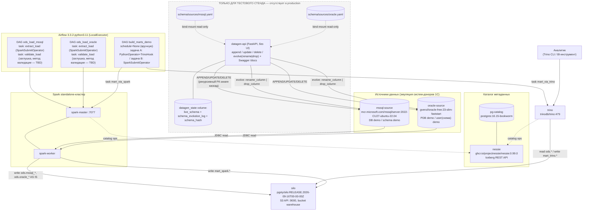

# datalake_stand — PoC стенда КХД → DLH

Локальный docker-compose стенд: загрузка данных из реальных реляционных
источников (MSSQL, Oracle) в ODS-слой Iceberg **AS IS**, и демонстрация
двух способов трансформации данных внутри DataLake (Trino SQL и Spark).

## Архитектура



## Состав стенда

**Контур A (релевантно production DLH-архитектуре):**

| Компонент           | Образ/версия                                                                                     |
| ------------------- | ------------------------------------------------------------------------------------------------ |
| mssql-source        | `mcr.microsoft.com/mssql/server:2022-CU27-ubuntu-22.04`¹                                         |
| oracle-source       | `gvenzl/oracle-free:23-slim-faststart`                                                           |
| pg-catalog          | `postgres:16.15-bookworm`                                                                        |
| nessie              | `ghcr.io/projectnessie/nessie:0.99.0`                                                           |
| silo                | `pgsty/silo:RELEASE.2026-09-16T00-00-00Z`                                                        |
| spark-master/worker | база `tabulario/spark-iceberg:3.5.5_1.8.1` + `mssql-jdbc:12.10.0.jre11` + `ojdbc11:23.8.0.25.04` |
| trino               | `trinodb/trino:479`                                                                              |
| airflow             | `apache/airflow:3.3.2-python3.11`, LocalExecutor                                                 |

¹ Закреплено на конкретном CU: `2022-CU27-ubuntu-22.04` — этот тег совпадает с `2022-latest` на 2026-10-09 (для воспроизводимости). Для обновления взять следующий `2022-CUxx-ubuntu-22.04` из каталога MCR.

**Контур B (только тестовый стенд, нет в production):** `datagen-api` —
REST API для наполнения источников синтетическими данными и ограниченной
эволюции их схемы (`rename_column`/`drop_column`). Схема источников
зафиксирована в `schema/sources/mssql.yaml` / `schema/sources/oracle.yaml`.

## Быстрый старт

```bash
docker compose up -d --build
```

Порты:

| Сервис                       | Порт на хосте |
| ---------------------------- | ------------- |
| mssql-source                 | 1433          |
| oracle-source                | 1521          |
| datagen-api                  | 8090          |
| nessie                       | 19120         |
| silo (S3 API / консоль)      | 9000 / 9001   |
| spark-master UI              | 8080          |
| spark-worker UI              | 8081          |
| trino (HTTPS)                | 8443          |
| airflow webserver/api-server | 8089          |

## Доступ к сервисам

### Web-интерфейсы

| Сервис | URL | Логин/пароль |
|---|---|---|
| Spark Master UI | http://localhost:8080 | без авторизации |
| Spark Worker UI | http://localhost:8081 | без авторизации |
| SILO (консоль, MinIO-совместимая) | http://localhost:9001 | `admin` / `admin123` (`SILO_ROOT_USER`/`SILO_ROOT_PASSWORD`) |
| datagen-api (Swagger UI) | http://localhost:8090/docs | без авторизации (см. `## Учётные данные` про сам инструмент) |
| Airflow | http://localhost:8089 | `admin` / `admin` (`AIRFLOW_UI_USER`/`AIRFLOW_UI_PASSWORD`) |

### Подключение из DBeaver (на машине, где запущен docker)

DBeaver подключается к `localhost` — порты опубликованы в `docker-compose.yaml`
(см. таблицу портов выше).

**Trino** — драйвер «Trino» (встроен в DBeaver):
- Host: `localhost`, Port: `8443`
- Use SSL: да (Trino работает по HTTPS с самоподписанным сертификатом)
- Catalog/Database: `iceberg`
- Username: `admin`, Password: `admin`
  (включена авторизация файловым password-authenticator'ом — см. `trino/etc/`)
- На вкладке Driver properties отключить проверку сертификата:
  `SSL=true;SSLVerification=NONE` (самоподписанный сертификат контейнера)
- JDBC URL целиком: `jdbc:trino://localhost:8443/iceberg?SSL=true&SSLVerification=NONE`

**mssql-source** — драйвер «SQL Server» (Microsoft):
- Host: `localhost`, Port: `1433`
- Database: `demo`
- Authentication: SQL Server Authentication
- Username: `admin`, Password: `admin`
  (прикладной логин `admin`/`admin` с правами sysadmin создаёт `datagen-api`
  при старте; системный bootstrap-логин `sa` использует сильный пароль
  `MSSQL_SA_PASSWORD` из `.env`)
- На вкладке Driver properties (или прямо в URL) нужно отключить шифрование/проверку
  сертификата, иначе DBeaver откажется подключаться к самоподписанному сертификату
  контейнера: `encrypt=false;trustServerCertificate=true`.

**oracle-source** — драйвер «Oracle»:
- Host: `localhost`, Port: `1521`
- Connection type: Service Name, значение `demo`
  (это pluggable database `demo`, созданная переменной `ORACLE_DATABASE=demo`,
  а не стандартный `FREEPDB1`)
- Username: `demo`, Password: значение `ORACLE_APP_PASSWORD` из `.env`
  (по умолчанию `admin`)
- Дополнительных настроек/Oracle Instant Client не требуется (используется
  тонкий JDBC-драйвер).

## Работа со стендом

### Наполнение/изменение данных в источниках — datagen-api

REST-интерфейс: `http://localhost:8090`, Swagger UI — `http://localhost:8090/docs`.
Все примеры ниже выполняются через Swagger UI.

Источники — реестр `datagen-api/config/sources.yaml`: `mssql`, `oracle`.
Схема сейчас одна — `demo`; таблицы: `customers`, `products`, `orders`.

| Метод | Путь | Назначение | Тело запроса |
| --- | --- | --- | --- |
| GET | `/sources` | список источников | — |
| GET | `/tables/{source}` | список таблиц источника | — |
| GET | `/tables/{source}/{schema}/{table}` | схема таблицы | — |
| POST | `/tables/{source}/{schema}/{table}/append` | вставить N строк | `{"rows": N, "new_key_ratio": r}` |
| POST | `/tables/{source}/{schema}/{table}/update` | обновить строки | `{"predicate": [{"column","operator","value"}, ...], "set": {...}}` |
| POST | `/tables/{source}/{schema}/{table}/delete` | удалить строки | `{"predicate": [{"column","operator","value"}, ...], "cascade": bool}` |
| POST | `/tables/{source}/{schema}/{table}/evolve` | rename/drop колонки | см. ниже |

Как вызвать ручку в Swagger UI:
1. Откройте `http://localhost:8090/docs`.
2. Разверните нужную операцию (например `POST /tables/{source}/{schema}/{table}/append`).
3. Нажмите **Try it out**.
4. В блоке **Parameters** подставьте path-параметры: `source`=`mssql` (или `oracle`), `schema`=`demo`, `table`=`customers`/`products`/`orders`.
5. В блоке **Request body** вставьте JSON из примера.
6. Нажмите **Execute** — внизу появится тело ответа и код статуса.

#### GET /sources — список источников
Параметров и тела нет. **Execute** → `{"sources":["mssql","oracle"]}`.

#### GET /tables/{source} — список таблиц
- `source`=`mssql` → `{"tables":["customers","products","orders"]}`;
- `source`=`oracle` → тот же список.

#### GET /tables/{source}/{schema}/{table} — схема таблицы
`source`=`mssql`, `schema`=`demo`, `table`=`orders` → JSON с `columns`, `primary_key`, `foreign_keys`.

#### POST .../append — добавить строки
Тело `{"rows": N, "new_key_ratio": r}`:
- `rows` — сколько строк вставить (1..100000);
- `new_key_ratio` — число 0..1, вероятность создания новой родительской записи по FK.

Как работает `new_key_ratio`, когда FK несколько (`orders` ссылается на `customers` и `products`):
- каждая FK-колонка обрабатывается **независимо**: с вероятностью `r` для неё создаётся новая запись в родительской таблице (рекурсивно), иначе берётся случайная существующая;
- `r=0` — оба FK всегда ссылаются на существующих клиентов/товары (родители должны быть непусты);
- `r=1` — каждый новый заказ создаёт и нового `customer`, и новый `product`;
- `r=0.5` — каждая колонка решает «новый/существующий» независимо, примерно 50/50;
- если родительская таблица пуста — новая родительская запись создаётся при любом `r` (переиспользовать нечего).

Пример: `source`=`mssql`, `schema`=`demo`, `table`=`orders`, тело `{"rows": 10, "new_key_ratio": 0.0}` — вставит 10 заказов со ссылками на уже существующих клиентов и товары.

#### POST .../update — обновить строки
Тело `{"predicate": [...], "set": {...}}`:
- `predicate` — список условий, объединяемых через `AND`. Каждое условие — объект
  `{"column": "...", "operator": "...", "value": ...}`:
  - `column` — существующая колонка таблицы (иначе `422`);
  - `operator` — один из `=`, `!=`, `<`, `<=`, `>`, `>=`;
  - `value` — значение сравнения; подставляется как параметр запроса, а не как SQL-текст.
- `set` — объект `{колонка: новое_значение}`; ключи должны быть колонками таблицы,
  значения тоже параметризуются. Можно указать несколько колонок: `{"segment": "VIP", "name": "Acme"}`.
- если в `set` попадает FK-колонка, а в родительской таблице нет строки с таким ключом —
  она создастся автоматически.

Произвольные SQL-фрагменты не принимаются: имена колонок проверяются по схеме таблицы
(allow-list), значения — bind-параметры, поэтому SQL-инъекция невозможна.

Примеры:
- `source`=`mssql`, `schema`=`demo`, `table`=`customers`,
  `{"predicate": [{"column": "customer_id", "operator": "=", "value": 1}], "set": {"segment": "VIP"}}`;
- `source`=`oracle`, `schema`=`demo`, `table`=`products`,
  `{"predicate": [{"column": "price", "operator": "<", "value": 100}], "set": {"price": 99.99}}`.

#### POST .../delete — удалить строки
Тело `{"predicate": [...], "cascade": bool}`:
- `predicate` — список условий (как в `update`), объединяемых через `AND`:
  `column` — колонка таблицы, `operator` ∈ `= != < <= > >=`, `value` — параметр;
- `cascade` — булево. Нужно, когда на таблицу ссылаются другие (на `customers` ссылается `orders`):
  - `false` — если на удаляемые строки есть ссылки, запрос вернёт `409`;
  - `true` — сначала удаляются ссылающиеся строки дочерних таблиц, затем целевые.

Примеры:
- `source`=`mssql`, `schema`=`demo`, `table`=`orders`,
  `{"predicate": [{"column": "order_id", "operator": "=", "value": 5}], "cascade": false}` — удалить один заказ;
- `source`=`mssql`, `schema`=`demo`, `table`=`customers`,
  `{"predicate": [{"column": "customer_id", "operator": "=", "value": 1}], "cascade": true}` — удалить клиента вместе с его заказами.

#### POST .../evolve — переименовать/удалить колонку
Тело `{"ddl_operation": "...", "column_name": "...", "new_column_name": "...", "apply_to": "..."}`:
- `ddl_operation`: `rename_column` | `drop_column`;
- `apply_to`: `mssql` | `oracle` | `both`;
- `new_column_name` обязателен только для `rename_column`;
- `drop_column` запрещён для PK/FK-колонок.

Примеры:
- `source`=`mssql`, `schema`=`demo`, `table`=`customers`, `{"ddl_operation": "rename_column", "column_name": "segment", "new_column_name": "tier", "apply_to": "both"}`;
- `source`=`mssql`, `schema`=`demo`, `table`=`products`, `{"ddl_operation": "drop_column", "column_name": "price", "apply_to": "both"}`.

### Обновление ODS-слоя Iceberg

Отдельные DAG-и в Airflow (расписание `schedule=None` — запуск вручную):

- `ods_load_mssql` → `spark/jobs/load_ods_mssql.py`: читает `demo.demo.*` из mssql-source и перезаписывает (AS IS) `iceberg.ods.mssql_customers`, `mssql_orders`, `mssql_products`;
- `ods_load_oracle` → `spark/jobs/load_ods_oracle.py`: читает `demo.*` из oracle-source и перезаписывает (AS IS) `iceberg.ods.oracle_customers`, `oracle_orders`, `oracle_products`.

Запуск — Airflow UI → DAGs → ▶, либо CLI:

```bash
docker compose exec -T airflow-scheduler airflow dags trigger ods_load_mssql
docker compose exec -T airflow-scheduler airflow dags trigger ods_load_oracle
```

Проверка результата (Trino): `SELECT count(*) FROM iceberg.ods.mssql_orders;`

### Обновление детального (mart) слоя

DAG `build_marts_demo` (вручную, `schedule=None`) — две независимые задачи:

- `mart_via_trino` → `trino/sql/build_mart_trino_demo.sql`: создаёт `iceberg.mart_trino.customer_totals` (`customer_id`, `orders_count`, `total_amount`) из `iceberg.ods.mssql_orders`;
- `mart_via_spark` → `spark/jobs/build_mart_spark_demo.py`: создаёт `iceberg.mart_spark.customer_totals` (`customer_id`, `orders_count`, `total_amount`) из `iceberg.ods.mssql_orders`.

Запуск:

```bash
docker compose exec -T airflow-scheduler airflow dags trigger build_marts_demo
```

Результат — таблицы `iceberg.mart_trino.customer_totals` и `iceberg.mart_spark.customer_totals` (читаются из Trino).

## Полное тестирование стенда

Полный флоу работы стенда проверяется автономным тестом: он поднимает стек,
прогоняет все этапы в контейнере и в конце полностью гасит сборку.

Запуск (из корня репозитория):

```bash
./scripts/full-test.sh
```

Скрипт делает:
1. `docker compose down -v --remove-orphans` — чистит прежние контейнеры и volume-ы (прежние данные не влияют на запуск);
2. `docker compose up -d --build` — собирает и поднимает весь стек;
3. `docker compose run --rm test-runner` — в отдельном контейнере прогоняет тест:
   - проверяет готовность Nessie / datagen-api / Trino / Airflow / Spark;
   - наполняет таблицы `customers`, `products`, `orders` в `mssql` и `oracle`, обновляет и удаляет часть строк;
   - corner-case: удаление FK-родителя без `cascade` (409), `drop_column` PK/FK (422), неизвестная колонка/оператор и SQL-инъекция (422);
   - запускает DAG-и `ods_load_mssql`, `ods_load_oracle` и сверяет таблицы `iceberg.ods.*` через Trino;
   - запускает DAG `build_marts_demo` и проверяет витрины `iceberg.mart_trino.customer_totals` и `iceberg.mart_spark.customer_totals`;
   - печатает сводку `PASS=n FAIL=m`;
4. `docker compose down -v --remove-orphans` — в любом исходе гасит сборку: удаляет контейнеры, сети и volume-ы (`pg_catalog_data`, `airflow_pg_data`, `silo_data`, `datagen_state`).

Результат: финальная строка `PASS=… FAIL=…`; exit-code 0 — всё прошло, при
FAIL — смотреть `.agents/skills/datalake-stand-verify/references/troubleshooting.md`.
После прогона стенд погашен, данные удалены; образы остаются в локальном кеше.

Предусловия: Docker + Docker Compose, склонированный репозиторий, `.env`
(уже закоммичен). Интернет нужен только для первого `build` образов — повторные
запуски работают офлайн.

Для разработки (стенд остаётся поднятым) — обычный `docker compose up -d --build`.

## Учётные данные

Тестовый стенд — везде, где логин/пароль настраиваемы, используется
`admin` / `admin` (см. `.env`). Исключение по имени — системный
bootstrap-логин MSSQL `sa`: имя фиксировано образом, а пароль не может быть
буквально `admin` (MSSQL требует длину ≥8 и минимум 3 из 4 категорий символов),
поэтому у `sa` остаётся сильный пароль `AdminPassword1!`, а для доступа извне
`datagen-api` автоматически создаёт логин `admin`/`admin` с ролью sysadmin.
SILO (консоль `:9001`) — `admin`/`admin123` (MinIO требует пароль ≥8 символов,
поэтому буквально `admin` невозможен), pg-catalog, airflow-postgres,
Airflow UI (`:8089`), Trino (`:8443`) — везде `admin`/`admin`. У Oracle системные SYS/SYSTEM и
прикладной пользователь-схема `demo` (бизнес-схема данных, имя сознательно
оставлено `demo`) — пароль `admin`.

## ⚠️ Важно: потеря данных при изменении схемы

Если изменить `schema/sources/mssql.yaml` или `schema/sources/oracle.yaml`
и перезапустить контейнер `datagen-api` — **все данные этого источника
будут удалены**, а таблицы пересозданы пустыми по новой схеме. Это
осознанное упрощение для тестового стенда: предыдущее состояние не
архивируется. Пока контейнер работает без перезапуска, изменения файла
на хосте не подхватываются — реакция происходит только при следующем
(пере)старте контейнера `datagen-api`.
